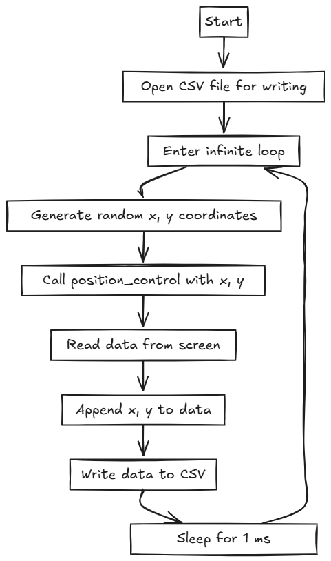
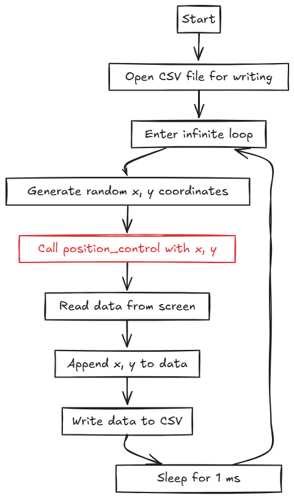
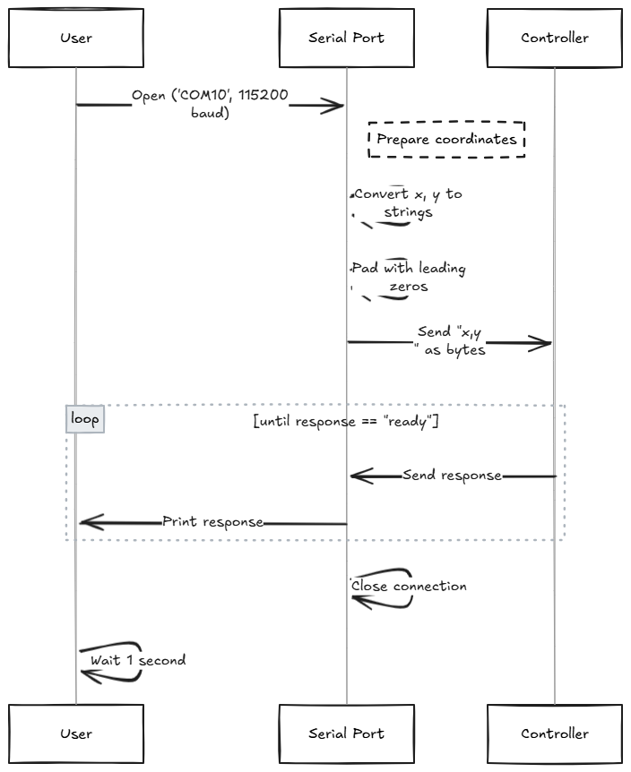
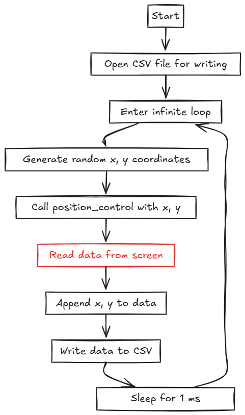
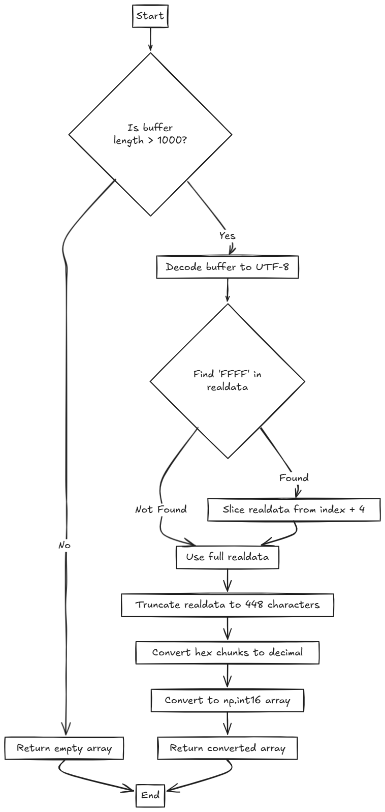
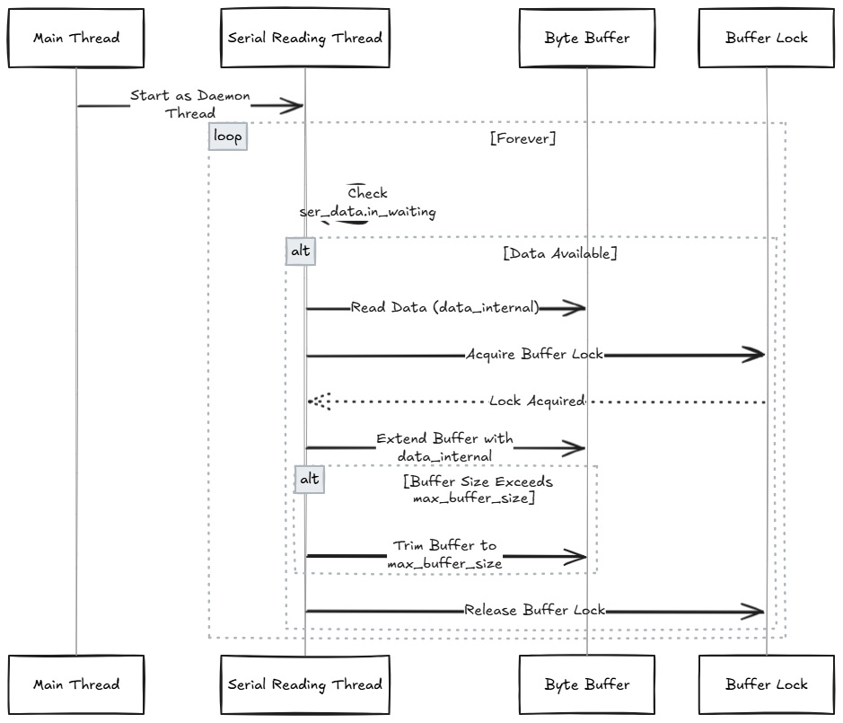




# 激光位置感知-数据收集
## 1.引言
### 1.1 背景
在激光位置感知技术快速发展背景下，传感器数据的采集与分析变得愈发重要。传感器能够实时监测激光在波导端面的强度变化，这些数据为判断激光照射点的位置提供了基础支撑，包括之前使用的十字线算法，也用到了类似的数据特征。随着深度学习技术的不断进步，利用大量传感器数据进行模型训练，能够显著提升预测准确性和决策能力。然而，数据的质量和多样性直接影响模型的性能，因此高效的数据收集策略显得尤为关键。
### 1.2 目的
本技术文档旨在详细阐述传感器数据的收集思路及其代码实现方法。首先，我们将解析数据源的选择和数据收集策略，确保所获取的数据具备良好的质量和代表性。接着，介绍具体的代码实现，包括数据采集、存储和预处理等步骤，以便为后续的深度学习模型训练提供可靠的训练集。
## 2.数据集概述
### 2.1数据源

<p align="center">
  
</p>

使用的传感器类型为光电二极管阵列，每个阵列由28个光电二极管组成，共有4组传感器阵列，每个光电二极管的电压信号通过STM32F407微控制器的内置ADC进行串行扫描获取。该系统能够不间断地进行数据采集，确保在各种照射条件下获取实时的波导端面光照强度信息。
### 2.2数据特征
#### 2.2.1采样频率
STM32F407配置为其最大的工作主频（168 MHz），以实现快速数据采集。根据系统设置，每次采样的时间已被优化，以实现高效的数据传输与处理。
#### 2.2.2数据格式
采集的数据以16位整数格式存储，表示每个光电二极管的光照强度值。每次完整的扫描会生成一个包含28个光电二极管数据的数组，并通过串口将其连续发送到上位机。
#### 2.2.3数据传输
数据通过串口接口以实时流的方式传输至上位机，确保数据的连续性和时效性。上位机负责接收、存储和后续的数据处理。


<p align="center">
  
</p>


### 2.3目标
本数据集的主要目的是用于坐标预测的回归任务。通过收集不同激光照射位置条件下光电二极管阵列的传感器数据，我们希望建立一个深度学习模型，以准确预测激光照射坐标位置。
具体而言，坐标预测模型将利用光电二极管阵列捕捉到的光照强度信息，结合环境特征，实现对激光照射位置的实时预测。通过训练模型，能够在复杂的环境中，基于传感器输入，提供高精度的位置信息。
## 3.数据收集的思路
### 3.1数据收集策略
-   在进行数据收集之前，首先需要确定数据采集的时间段。这可以根据实际应用需求来决定，例如选择在不同的时间段（白天、夜晚、阴天等）进行收集，以捕捉环境光照（背景噪声）变化的多样性。
-   同时，设定合理的采样频率是至关重要的。高频采样能够捕捉到更多的细节，但会增加数据量和处理复杂度。一般而言，采样频率应根据光电二极管的响应时间和应用场景进行优化，确保数据的实时性与可用性。
### 3.2数据质量考虑
-   数据的完整性和准确性直接影响到后续模型的训练效果。应实施有效的数据验证策略，确保在数据收集和传输过程中不丢失任何重要信息。
-   在数据记录和存储过程中，定期检查数据的完整性，以防止因设备故障或通信问题导致的数据缺失。同时，确保采集的每个数据点都经过校验，以维护数据的准确性。
## 4.数据收集的方法
### 4.1传感器接口
在本项目中，我们选择使用**串口通信**（UART）与光电二极管阵列进行数据传输。串口通信是一种简单而有效的接口方式，适合与STM32F407微控制器进行实时数据交换。我们将波特率设置为 **115200 bps**，以确保数据传输的速度和稳定性。
### 4.2数据采集
数据采集将在上位机上使用Python进行。以下是一个示例代码，展示如何通过串口读取传感器数据：

python
```
import serial
import csv
import time

# 配置串口
port = 'COM3'  # 根据实际情况修改端口名
baudrate = 115200
timeout = 1  # 设置超时为1秒

# 打开串口
ser = serial.Serial(port, baudrate, timeout=timeout)

# 数据存储文件
csv_file = 'sensor_data.csv'

# 打开CSV文件以写入数据
with open(csv_file, mode='w', newline='') as file:
    writer = csv.writer(file)
    writer.writerow(['Timestamp', 'Sensor Data'])  # 写入表头

    try:
        print("开始数据采集...")

        while True:
            # 读取一行数据
            line = ser.readline().decode('utf-8').strip()  # 读取并解码
            if line:
                timestamp = time.time()  # 获取时间戳
                writer.writerow([timestamp, line])  # 写入数据
                print(f"读取数据: {line}")  # 打印读取的数据

    except KeyboardInterrupt:
        print("数据采集结束.")
    finally:
        ser.close()  # 关闭串口

```

在这段代码中：

-   我们使用 `pyserial` 库来处理串口通信。
-   设置串口端口和波特率，并打开串口进行数据读取。
-   通过 `ser.readline()` 读取从传感器发送的数据，并将其解码为字符串。
-   每次读取数据时，记录当前时间戳，并将时间戳和传感器数据写入 CSV 文件 (`sensor_data.csv`)。
### 4.3数据存储
在数据存储方面，我们选择将传感器数据实时存储到 **CSV 文件** 中。CSV 格式易于理解和处理，适合后续的数据分析和模型训练。在代码示例中，数据以时间戳和传感器数据的形式存储在 CSV 文件中，便于后续的读取和分析。
## 5.代码实现思路
### 5.1代码结构

<p align="center">
  
</p>

### 5.2主要功能

#### 5.2.1 位置控制

<div style="display: flex; justify-content: space-around; align-items: center;">
  
  
</div>

#### 5.2.2 读取数据

<div style="display: flex; justify-content: space-around; align-items: center;">
  
  
</div>


#### 5.2.3 并行数据接收

<p align="center">
  
</p>

## 6实物演示

<div style="display: flex; align-items: center;">
  
</div>

## 7数据集演示

<div style="display: flex; align-items: center;">
  
</div>
